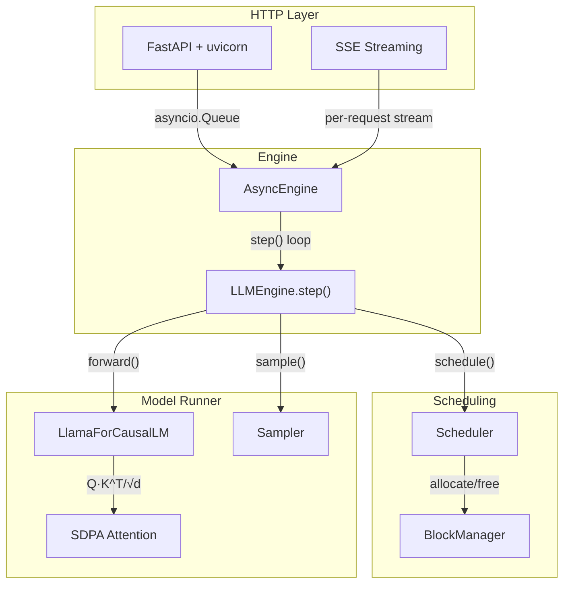

# nanoserve

**A production-shaped LLM serving engine built from scratch in Python.** Paged KV cache, continuous batching, prefix caching, a custom Triton attention kernel, and speculative decoding — behind an OpenAI-compatible streaming API.

nanoserve is not a wrapper. Every component — the block allocator, the scheduler, the attention kernel, the sampler — is implemented from first principles, with a test suite that runs on CPU and correctness gates that enforce distribution-equivalence against reference implementations.

---

## ✨ Key Features

| Feature | Status | Description |
|:---|:---:|:---|
| **Llama-family forward pass** | ✅ | RMSNorm, RoPE, GQA, SwiGLU — from scratch in PyTorch |
| **Paged KV cache** | ✅ | Block allocator, refcounting, COW, scatter/gather kernels (Week 2) |
| **Greedy decoding** | ✅ | Deterministic argmax sampling |
| **Full sampling suite** | ✅ | temperature, top-k/p, min-p, repetition/freq/presence penalties, seeds (Week 3) |
| **Continuous batching** | ✅ | Iteration-level scheduling, zero padding, dynamic admission (Week 4) |
| **Preemption** | ✅ | Recompute + CPU host memory swap, zero OOM guarantee (Week 5) |
| **Chunked prefill** | ✅ | Mixed prefill/decode batches, zero decode starvation (Week 6) |
| **Prefix caching** | ✅ | Content-addressed, hash-chained, LRU eviction (Week 7) |
| **Triton paged attention** | ✅ | Fused decode kernel with online softmax & dual dispatch (Week 8) |
| **Speculative decoding** | ✅ | N-gram prompt-lookup + draft model with verification & rollback (Week 9) |
| **OpenAI-compatible API** | ✅ | `/v1/chat/completions`, `/v1/completions`, SSE streaming |
| **Scheduler** | ✅ | FCFS admission with block-budget enforcement |
| **Prometheus metrics** | ✅ | TTFT/TPOT histograms, KV utilization, queue gauges |
| **Model loading & weights** | 🔲 | SafeTensors + HuggingFace loader (Week 10) |

---

## 🏗️ Architecture



**Design rule:** the scheduler never touches tensors, and the model runner never makes policy decisions. This separation makes the scheduler fully unit-testable on CPU.

---

## 🚀 Quickstart

### Installation
```bash
git clone https://github.com/Imtiaz-Hasan/nanoserve.git
cd nanoserve
uv sync --extra dev
```

### Launch the server (toy model, CPU)
```bash
uv run nanoserve --model toy --device cpu --port 8000
```

### Send a request
```bash
curl -N http://localhost:8000/v1/chat/completions \
  -H "Content-Type: application/json" \
  -d '{
    "model": "toy",
    "messages": [{"role": "user", "content": "Hello"}],
    "max_tokens": 32,
    "temperature": 0,
    "stream": true
  }'
```

### Docker
```bash
docker build -t nanoserve .
docker run -p 8000:8000 nanoserve
```

---

## 🧪 Testing

```bash
# Run the full test suite (CPU, no GPU required)
make test

# Lint + format + typecheck
make check
```

The test suite uses a randomly-initialized 2-layer, 4-head, 64-dim toy model that is structurally identical to production Llama-family models. All scheduler, allocator, and sampling tests run on CPU.

---

## 📊 KV Memory Calculator

nanoserve logs its own memory budget at startup:

```
KV bytes per token = 2 × num_layers × num_kv_heads × head_dim × dtype_bytes
```

For Qwen2.5-7B (28 layers, 4 KV heads, head_dim 128, fp16): `2 × 28 × 4 × 128 × 2` = **56 KiB/token**. A 16-token block is ~896 KiB.

---

## 🚫 Explicitly Out of Scope

Naming what you deliberately did not build signals engineering maturity.

- **Multi-GPU** (tensor/pipeline parallelism) — single-GPU only
- **Training or fine-tuning** of any kind
- **Quantization** beyond fp16/bf16 weights
- **Model architectures** beyond decoder-only Llama-family (Llama 3.x, Qwen 2.5, Mistral, TinyLlama, SmolLM)
- **Beating vLLM.** The goal is to be within a defensible factor and to explain the gap precisely

---

## 📚 References

- [Efficient Memory Management for LLM Serving with PagedAttention](https://arxiv.org/abs/2309.06180) (Kwon et al., SOSP 2023)
- [Orca: A Distributed Serving System for Transformer-Based Generative Models](https://www.usenix.org/conference/osdi22/presentation/yu) (Yu et al., OSDI 2022)
- [Fast Inference from Transformers via Speculative Decoding](https://arxiv.org/abs/2211.17192) (Leviathan et al., ICML 2023)
- [FlashAttention-2](https://arxiv.org/abs/2307.08691) (Dao, 2023)

---

## 📜 License

Distributed under the MIT License. See [LICENSE](LICENSE) for details.
