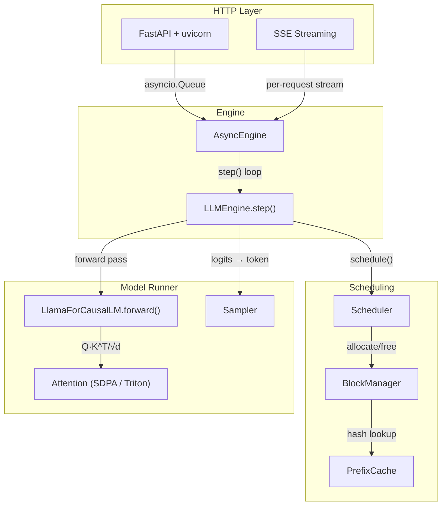

# nanoserve Architecture

## System Overview

## Data Flow

1. **Request arrives** at the FastAPI endpoint (`/v1/chat/completions`)
2. **AsyncEngine** wraps it in a `SequenceGroup` and submits to the scheduler
3. **Scheduler** decides which sequences to run this iteration (budget-constrained)
4. **BlockManager** allocates/extends KV cache blocks for scheduled sequences
5. **LLMEngine.step()** builds the batch and calls the model forward pass
6. **LlamaForCausalLM** runs embedding → decoder layers → norm → lm_head
7. **Attention** computes Q·K^T/√d with RoPE and GQA head expansion
8. **Sampler** selects the next token from logits (greedy / stochastic)
9. **Engine** checks stop conditions, appends token, and streams the result back

## Key Design Rule

> The scheduler never touches tensors, and the model runner never makes policy decisions.

The scheduler outputs a plain dataclass describing the batch (sequence IDs, block tables, token counts). The runner executes it. This separation makes the scheduler unit-testable on CPU without a GPU.
