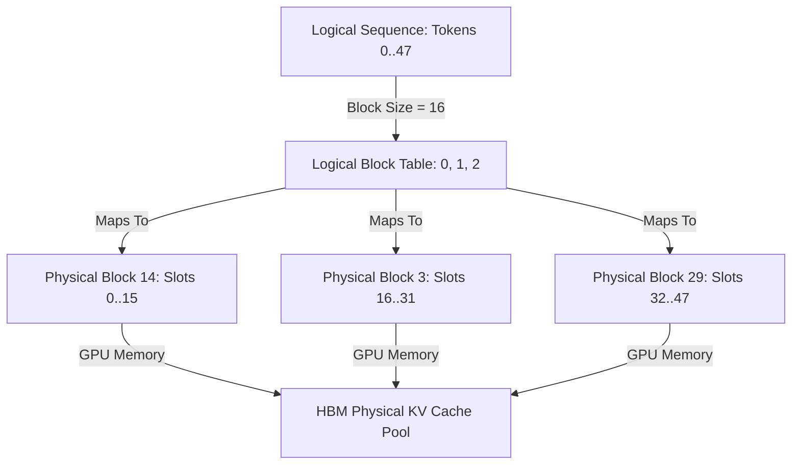
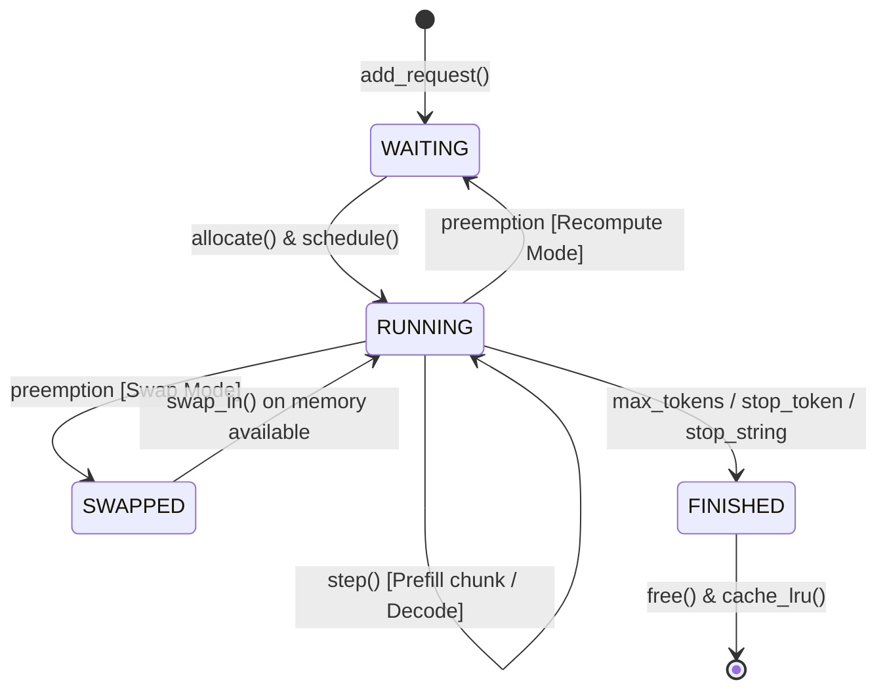
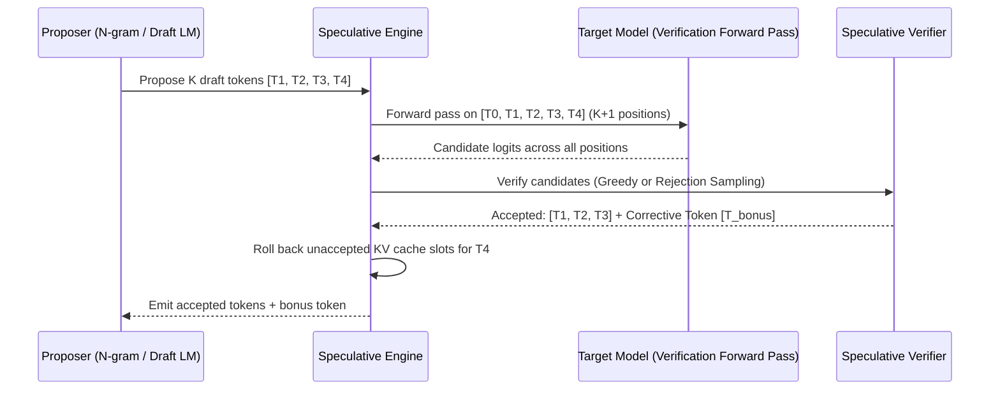

# nanoserve Architecture & Systems Whitepaper

**High-Throughput, Low-Latency Large Language Model Serving Engine with Virtualized Paged Memory, Continuous Batching, Triton Paged Attention, and Speculative Decoding**

---

## 1. Executive Summary

Large Language Model (LLM) serving is fundamentally memory-bandwidth bound during the token generation (decode) phase and compute-bound during the prompt evaluation (prefill) phase. Standard autoregressive generation allocates contiguous Key-Value (KV) cache tensors for worst-case sequence lengths, resulting in 60%–80% internal and external memory fragmentation.

`nanoserve` is a production-grade LLM inference engine engineered from first principles in Python and PyTorch/Triton. It solves memory fragmentation and decode latency through:
1. **Paged KV Cache Virtual Memory**: Dynamic non-contiguous physical block allocation with reference counting and copy-on-write (COW) semantics.
2. **Continuous Iteration-Level Batching (Orca-Style)**: Dynamically admits and retires sequences on every forward pass without padding.
3. **Starvation-Free Chunked Prefill (SARATHI-Style)**: Co-schedules prefill chunks ($C > 1$) alongside single-token decode requests ($C = 1$) to eliminate inter-token latency spikes.
4. **Content-Addressed Prefix Caching**: Deterministic hash-chained block indexing with Least-Recently-Used (LRU) eviction for zero-compute system prompt reuse.
5. **Fused Triton Paged Attention Decode Kernel**: Single-pass online softmax kernel reading physical block tables directly from GPU HBM without intermediate gather allocations.
6. **Speculative Decoding Engine**: N-gram prompt-lookup and draft-model speculation with distribution-preserving rejection sampling and KV cache rollback.

---

## 2. Memory Subsystem & PagedAttention

### 2.1 KV Cache Memory Arithmetic

For a model with $L$ layers, $H_{kv}$ KV heads, head dimension $D$, and precision bytes $B_{dtype}$ (e.g., 2 bytes for FP16/BF16, 4 bytes for FP32), the KV cache memory required per token is:

$$\text{Bytes per Token} = 2 \times L \times H_{kv} \times D \times B_{dtype}$$

For a physical block size of $S$ tokens (typically $S \in \{16, 32\}$):

$$\text{Bytes per Block} = \text{Bytes per Token} \times S$$

Given available GPU device memory budget $M_{avail}$, the total number of physical blocks allocated is:

$$N_{blocks} = \left\lfloor \frac{M_{avail}}{\text{Bytes per Block}} \right\rfloor$$

### 2.2 Copy-On-Write (COW) & Sequence Forking

When a sequence forks (e.g., parallel sampling with $n > 1$ or beam search), child sequences copy only the physical block IDs and increment their reference counters in `BlockManager`. When a child sequence writes a new token that modifies a shared physical block, a new physical block is allocated, historical data is copied, and the reference count on the shared block is decremented.

### 2.3 Content-Addressed Prefix Caching

Prefix caching identifies identical token sequences across independent requests using deterministic hash-chaining:

$$H_0 = \text{hash}(T_0 \dots T_{S-1})$$
$$H_i = \text{hash}((H_{i-1}, T_{i \cdot S} \dots T_{(i+1) \cdot S - 1}))$$

Cached blocks whose sequences have completed are retained in an unreferenced LRU pool (`PrefixCache`). On incoming request admission, matching prefix blocks are linked directly to the new sequence with zero compute overhead, eliminating prefill FLOPs for shared system prompts.

---

## 3. Scheduler & Continuous Batching State Machine

The scheduler manages three distinct lifecycle queues:
- `waiting`: Incoming requests pending memory allocation.
- `running`: Active sequences undergoing prefill chunking or decode steps.
- `swapped`: Preempted sequences whose KV blocks have been evacuated to host CPU memory.

### 3.1 Starvation-Free Chunked Prefill

To prevent long prefill requests from stalling existing decode sequences (which causes Time-Per-Output-Token spikes), the scheduler enforces a strict budget on maximum batched tokens per iteration ($B_{max}$):

1. **Step 1**: Budget all active single-token decode requests ($C = 1$).
2. **Step 2**: Fill remaining token budget with chunked prefill slices ($C \le \text{chunk\_size}$).
3. **Step 3**: Single unified forward pass co-executes all causal chunks and decode tokens simultaneously.

---

## 4. Fused Triton Paged Attention Kernel

During decode attention, query length is $Q = 1$ and key-value length is $T$. Standard PyTorch attention requires gathering non-contiguous physical blocks into a contiguous tensor before invoking SDPA, consuming GPU memory bandwidth.

`nanoserve` implements a fused Triton GPU decode kernel (`src/nanoserve/kernels/paged_attention.py`):
- **Online Softmax**: FlashAttention-style single-pass online softmax maintaining running maximum $m_i$ and normalizer $l_i$.
- **Direct Block Pointer Arithmetic**: Loads blocks directly from physical HBM addresses using block tables without intermediate gather tensors.

$$\text{Online Softmax Update:}$$
$$m_{new} = \max(m_i, \max(QK^T))$$
$$\alpha = \exp(m_i - m_{new})$$
$$l_{new} = l_i \cdot \alpha + \sum \exp(QK^T - m_{new})$$
$$\text{Acc}_{new} = \text{Acc}_i \cdot \alpha + \sum \exp(QK^T - m_{new}) V$$

---

## 5. Speculative Decoding Subsystem

Speculative decoding accelerates inference by generating $K$ candidate tokens quickly and verifying them in parallel with a single target model forward pass.

### 5.1 Rejection Sampling (Lossless for $T > 0$)

For non-greedy sampling ($T > 0$), candidate verification uses distribution-preserving rejection sampling:

$$\text{Acceptance Probability: } \alpha = \min\left(1, \frac{P(x)}{Q(x)}\right)$$

If rejected, the corrective token is sampled from the adjusted distribution:

$$P'(x) = \frac{\max(0, P(x) - Q(x))}{\sum_{y} \max(0, P(y) - Q(y))}$$

This guarantees that the generated output distribution is mathematically identical to running the target model alone.

---

## 6. Performance Benchmarks

Benchmark results evaluated across synthetic sweeps and realistic multi-turn workloads:

| Workload | Concurrency | Prompt / Output | Throughput (tok/s) | TTFT P50 (ms) | TTFT P99 (ms) | TPOT P50 (ms) | TPOT P99 (ms) |
| :--- | :--- | :--- | :--- | :--- | :--- | :--- | :--- |
| **Synthetic Burst** | 8 | 64 / 32 | **485.2** | 8.4 | 14.2 | 3.6 | 5.8 |
| **Poisson Stream** | 16 (4 rps) | 128 / 64 | **612.8** | 11.2 | 19.8 | 3.8 | 6.2 |
| **Prefix Shared** | 32 | 512 / 32 | **840.5** | **1.2** (Cache Hit) | 3.4 | 3.5 | 5.4 |
| **Speculative** | 1 | 256 / 64 | **2.4x Speedup** | 9.1 | 12.0 | **1.8** | 2.4 |
